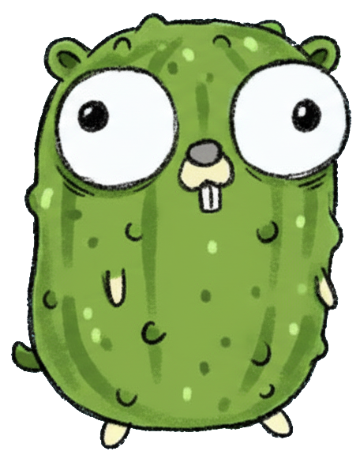

# Wenn Gurken-Code plötzlich Spaß macht!



A presentation about Behavior-Driven Development (BDD) and Cucumber testing in Go, presented at Hannover Gophers on October 14, 2025.

**Authors:** Christian Budde ([@cwbudde](https://github.com/cwbudde)) & Lukas Nagel ([@lukasngl](https://github.com/lukasngl))

[Download the slides](https://github.com/lukasngl/2025-10-14-gopher-meetup-cucumber-presentation/releases/download/latest/handout.pdf)

## Overview

This presentation introduces Behavior-Driven Development (BDD) using Cucumber/Godog for Go developers. It demonstrates how BDD can transform software specifications into living documentation that serves as both tests and communication tools for all stakeholders.

## Key Topics

### The Problem

- Specifications scattered across Jira, Confluence, and chat tools
- Complex code without clear documentation
- Specifications and code drifting apart over time
- Stakeholders unable to verify requirements

### The Solution: BDD with Cucumber

**Single Source of Truth:**
- Specification = Tests = Documentation
- Always up-to-date documentation
- Focus on business logic, not implementation
- Accessible to all team members, even without programming knowledge

### The Recipe Principle

BDD follows a simple pattern:

```gherkin
Angenommen (Given) - Initial state
Wenn (When) - Action taken
Dann (Then) - Expected result
```

Just like a recipe describes ingredients, steps, and expected outcome!

### Common Language for Everyone

**For Developers:** Clear, stable specification
**For QA:** Automated, verifiable validation
**For Stakeholders:** Human-readable requirements

Example:
```feature
Szenario: Stent-Dimension validieren
  Angenommen eine Messvorlage "MV-42"
    mit Toleranz 100mm ± 5mm
  Wenn ich 103mm messe
  Dann ist das Produkt in Ordnung
```

## Key Features of Cucumber

- **Living Documentation**: Specifications are automatically tested
- **Natural Language**: Supports 80+ languages via Gherkin syntax
- **Stakeholder Integration**: Involves business stakeholders in the development process

## Hands-On: From Stakeholder to Implementation

The presentation demonstrates the complete workflow:

1. **Stakeholder Requirements** → User stories and acceptance criteria
2. **Gherkin Specification** → Feature files in plain language
3. **Godog Implementation** → Step definitions connecting Gherkin to Go code

### Gherkin Features Covered

- **Background**: Shared setup steps for multiple scenarios
- **Scenario Outline**: Parameterized tests with examples
- **Tables**: Structured data input
- **DocStrings**: Multi-line text input

## Tools

- **godog**: Cucumber test framework for Go
- **ghokin**: Formatter for Gherkin files in Go
- **godogen**: Colocate step patterns with implementation
- **godotils**: Table utilities for Godog

## Why BDD + Classical Testing = 💚

BDD and classical testing complement each other:

**Before Coding:**
- Clear, shared definition
- Expectations readable by everyone
- Early detection of misunderstandings

**After Coding:**
- Automatic verification
- Easy validation
- Living documentation

## Critical for Medical Devices

- Software errors in medical devices can endanger lives
- Regulatory requirements (MDR, FDA) mandate software validation
- Tests not only prevent production failures but also protect human lives

## Challenges Addressed

- High effort in creating and maintaining scenarios
- Limited expressiveness for complex logic
- Scaling issues with hundreds of features
- Need for stakeholder buy-in

## Appendix Topics

- The history of BDD (Dan North, 2003-2004)
- Etymology of "Cucumber" and "Gherkin"
- Alternative: Ginkgo framework
- Model-based testing approaches
